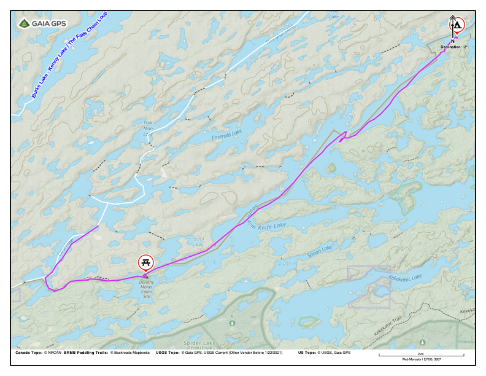
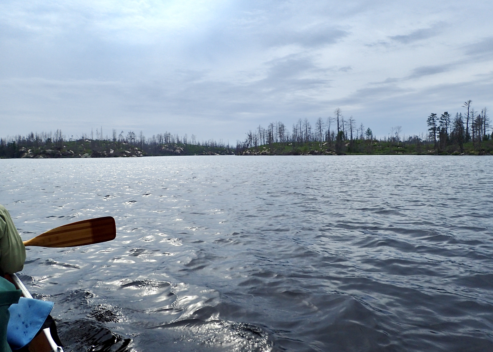

# Quetico Hunter Island 2025

## Index

 1. 2025-08-06 - [Bottle Portage on Lac la Croix to island N of Saturday Bay Crooked Lake](#2025-08-06-day-1-bottle-portage-on-lac-la-croix-to-island-n-of-saturday-bay-crooked-lake)
 2. 2025-08-07 - [Crooked Lake to Moose Bay on Basswood River](#2025-08-07-day-2-crooked-lake-to-moose-bay-of-basswood-river)
 3. 2025-08-08 - [Basswood River to Canadian Point of Basswood Lake](#2025-08-08-day-3-moose-bay-of-basswood-river-to-canadian-point-on-basswood-lake)
 4. 2025-08-09 - [Basswood Lake to small island on Carp Lake](#2025-08-09-day-4-canadian-point-on-basswood-lake-to-carp-lake)
 5. 2025-08-10 - [Carp Lake to Ottertrack Lake near Little Knife Portage](#2025-08-10-day-5-carp-lake-to-ottertrack-lake)
 6. 2025-08-11 - [Ottertrack Lake to Saganagons Lake](#2025-08-11-day-6-ottertrack-lake-to-saganagons-lake)
 7. 2025-08-12 - [Saganagons Lake to Koko Falls portage](#2025-08-12-day-7-saganagons-lake-to-koko-falls)
 8. 2025-08-13 - [Koko Falls to island SW of Rose Island on Kawnipi Lake](#2025-08-13-day-8-koko-falls-to-west-of-rose-island-on-kawnipi-lake)
 9. 2025-08-14 - [Kawnipi Lake to burned island on Shelley Lake](#2025-08-14-day-9-west-of-rose-island-on-kawnipi-lake-to-shelley-lake)
10. 2025-08-15 - [Shelley Lake to downstream of Chatterton Falls on Russell Lake](#2025-08-15-day-10-shelley-lake-to-downstream-of-chatterton-falls-on-russell-lake)
11. 2025-08-16 - [Russell Lake to SW end of Sturgeon Lake, near exit to Maligne River](#2025-08-16-day-11-russell-lake-to-the-end-of-sturgeon-lake)
12. 2025-08-17 - [Maligne River to Tanner Lake E of May Island](#2025-08-17-day-12-end-of-sturgeon-lake-to-maligne-river)
13. 2025-08-18 - [Tanner Lake to Lou Island below Twin Falls of the Maligne River](#2025-08-18-day-13-tanner-lake-to-twin-falls-on-the-maligne-river)
14. 2025-08-19 - [Twin Falls on Maligne to Eau Claire](#2025-08-19-day-14-twin-falls-on-maligne-to-eau-claire)

## 2025-08-03 Boise to Eau Claire

Royce retrieves me and my luggage from MSP and delivers us to Dunbar's Canoe
Outfitting in Eau Claire. We have a nightcap, look at pictures from earlier
Quetico trips, and chat.

[index](#index)

## 2025-08-04 Preparations in Eau Claire

*Mighty were their preparations.*

Royce has done a good job of organizing. He bought and packaged food, drink, and
fuel, and found, tested, and organized the necessary gear. But we still manage
to run hither and thither, until we start putting things into things, those
things into other things, and those things into his truck. But we do have some
presence of mind&mdash;we remember to pack our passports so that they'll be easy
to access when we reach customs.

[index](#index)

## 2025-08-05 Eau Claire to Zup's

We set an alarm for 0-dark-thirty. Before departure, Brenda takes what she calls
&ldquo;the final picture.&rdquo;

The drive to Crane Lake was easy, except for construction around Duluth.

At the Crane Lake marina, we unload our gear into Zup's boat, I put our canoe on
the boat, and Royce arranges parking. With us and two other groups on board, the
boat departs for Canadian customs.

Clearing customs was painless. Two agents met us on their dock on Sandpoint
Lake. One agent checked Royce's and my passports, briefly chatted with us, and
waved off that we were slightly over our duty-free liquor allowance. The rest of
the passengers were handled equally expeditiously, and we were on our way to
Zup's on Lac la Croix.

There are two mechanized (rail) portages between Crane Lake and Lac la Croix:
the Loon Falls Portage (Little Vermillion Lake to Loon River) and the Beatty
Portage (Little Loon Lake to Lac la Croix). Years ago, Dwight and I paddled to
the Beatty Portage because I thought the name was fun and for something to
do. This trip is the first time I’ve seen the railroads in operation, and the
first time I've seen the Loon River Portage.

Royce is very happy that Zup's has cold beer. Dinner was minestrone soup, pasta
salad, generous slices of a well-prepared prime rib, baked potato,
bacon-wrapped asparagus, and carrot cake for dessert.

Our server was a young woman from New Zealand who told us that she works at
similar operations year-round, but that she moves between northern and southern
hemisphere, because she doesn't like winter.

After dinner, a boat took us to a room on another island. When we arrived, a
small group was cleaning fish on the dock.

The room had a run-down Motel 6 vibe, but was acceptable. We were surprised at
the lack of potable water. Fortunately, I'd filled our bottles at the dining
hall.

We headed to bed when the mosquitoes started to bite. Rain is threatening.

## 2025-08-06 Day 1: Bottle Portage on Lac la Croix to island N of Saturday Bay Crooked Lake

Lac la Croix, Bottle Lake, Iron Lake, Crooked Lake. 11.1 miles.

Zup's picked us up promptly at 6:30.

Until they were were dropped off at the Black Robe Portage, we shared the boat
with a family that was taking their first canoe trip. Mom was *way* out of her
comfort zone but was being brave&mdash;her first time in a boat was her trip to
Zup's, yesterday. She took her first swim lessons to prepare for this trip. Dad
had been on canoe fishing trips before but had not led one. The daughter, who I
guessed to be about 10, was all in on whatever dad was doing. Grandma and
grandpa seemed bemused. Based on his gear choices, mom's brother seemed to think
he would be lounging on a beach. Their tent was huge and was meant for car
camping&mdash;it even included a porch. Its case had little wheels that
might've been appropriate for a paved campground but not for even the best of
portages. As I understood them, their plan was to put six people in one large
canoe and to tow a solo canoe, which would hold their gear. I wish them well.

We were dropped off at at Bottle Portage at around 9:00.

### 2025-08-06T17:53:31-05:00 (48.20686, -91.84773) 1244 feet Camp on Crooked Lake

We've been in camp for an hour or so. I used the inReach to let the home front
know that we are here and that we are safe.

This year, Royce is experimenting with using trekking poles on the portages. So
far, he feels they help.

We saw a few groups on the portages.

The paddle through Bottle Lake and Iron Lake was easy, and and we moved fast.

The Curtain Falls portage took something out of both of us. As we paddled into
Crooked, the wind steadily built. Because of the SSW wind, I skirted the shore
of Sunday Bay. The wind kept building, but the gusts were my biggest concern. We
both got so tired that we pulled up next to shore and took a breather.

Since we have a BWCA permit, we decided to not fight the wind and to camp on the
US side.

We leapfrogged a group of seven young people that are using aluminum canoes. (We
later learned they are scouts.) Because of the MN2 is a fast boat and our
technique is better, we moved much faster on the water than they did.

The wind made is somewhat difficult to set up the tent, but with that done, we
have &ldquo;cocktail a few minutes&rdquo;&mdash;El Jimador with lime and salt,
and snacks. We miss Jim and reminisce about our 2002 trip with him and Royce's
boys.

Dinner is a bag salad and Royce's *ropa vieja* (old rope), with &ldquo;that's
not rice&rdquo; rice. Royce continues to make sure we eat well.

As we were pitching the tent, green beetles&mdash;the same hue as the rain
fly&mdash;landed on the tent. They had perfect camouflage, just in the wrong
place. We both got a kick out of that.

There are a few breaks in the clouds. It is quite still and humid, and the bugs
are whining outside of tent.

[Index](#index)

## 2025-08-07 Day 2: Crooked Lake to Moose Bay of Basswood River

Crooked Lake, Basswood River. 13.2 miles.

### 2025-08-07T18:12:17-05:00 (48.14664, -91.69657) 1254 feet: Camp in Moose Bay

We slept hard until thunder and rain woke us. When it came, we learned that
there is a trick to releasing the toggle that holds the rain fly out of the
way&mdash;one must be very careful to slide the toggle directly out of the loop
without allowing it to twist.

On the water well after 8:00.

Sunny, calm, enervating humidity.

Yesterday's group with three canoes paddled past us as we were breaking camp.

When we left camp, there were only light riffles on the lake and I was so into
how fast we were paddling that I was't watching the map closely enough and so
took us into a dead-end bay. By the time I realized what I had done, we had
paddled a mile or so out of the way. I still can't paddle and navigate at the
same time.

As the day went on, the wind from the south picked up. The sky went from clear
to cloudy and back again a few times.

After paddling for a few hours we slowed, but we were still averaging around 3
mph. When the wind shifted to blow on our beam, we slowed again because more of
my effort went towards keeping us on course.

When we decided to break for lunch, we headed to a BWCA campsites because they
tend to have easy landings, and are often open to the breeze. When we got to the
nearest site shown on our maps, the terrain matched the map so exactly that I
would have been confident, even without the GPS, that we were where the map
shows the site. But there was no campsite&mdash;just a thick layer of lichen
where it should have been. (So there has been little or no traffic there for
years, leaving me to wonder, how old are these maps?) However, the nearby
campsite in Quetico was right where the map said it should be *and* it had a
broken BWCA fire grate. We wondered, when the BWCA camp was closed, whether some
enterprising soul moved the grate across the border.

The narrows of Crooked Lake/Basswood River have more current than I remember;
even though we paddled hard, the current slowed us to just over 1 mph.

We decided that we will not tackle the first Basswood River portage today
because we both recall that the campsites close to the portage aren't pleasant.
Royce remembered that we had gone into Moose Bay on one of the trips with Ian,
so we looked there and found a lovely campsite, just inside the bay and off the
border route. We set up camp, then Royce fished and I took a couple of short
swims. &ldquo;Cocktail much less than an hour&rdquo; with lime, salt, El
Jimador, and snacks. Royce is cooking dinner.

Our plan for tomorrow is to set off early so that we can make it past the Horse
Portage with enough time to paddle far enough to reach a nice campsite on
Basswood Lake.

We heard thunder in the distance several times and the skies repeatedly cycled
between overcast and clear. Now, most clouds are mares tales, so we predict good
weather well into the evening.

[index](#index)

## 2025-08-08 Day 3: Moose Bay of Basswood River to Canadian Point on Basswood Lake

Basswood River, Basswood Lake. 16.9 miles.

<!-- I logged this location the next morning. Coordinates and elevation got from
     that. The coordinates are very close to the GPS waypoint 20250808 and the
     elevation from map. -->
### 2025-08-08T17:59:40-05:00 (48.06107, -91.56269) 1297 feet: Camp on Canadian Point

Oh God, the bugs. We've been lucky that they're not nearly as active in the
morning.

We leapfrogged the group of seven and learned that they are a scouting group
doing their
[*Order of the Arrow*](https://en.wikipedia.org/wiki/Order_of_the_Arrow) trip,
which I'm told is a significant milestone. Quick math told me that the sum of
ages of the scouts & their guides added up to less than the sum of our ages and
that our canoe is older than any two of them.

One of their group, a young woman, was trying to get a pack on that was clearly
too heavy for her. But after I helped her to get the pack on, she moved faster
on the trail than I could. Youth...

The Lower Basswood Falls portage was easy.

Where the outflow of two parts of Wheelbarrow Falls collide, the paddling is a
little tricky. It's been so long since I've done this route that that I'd
forgotten about that.

In spots, the river had flooded the portage, but the trail bed was firm, so we
just sloshed through the water.

In another "it's been a long time", I'd forgotten about the short portage that
comes between Wheelbarrow Falls and Basswood Falls (Horse Portage). The current
kept me from landing where I wanted to, which turned out to be a good thing
because we ended up at the correct place. On this portage, we met a young couple
that were heading to Crooked. They were carrying only two small packs in
addition their canoe and two paddles (no spare). We greatly admire their gear
discipline.

(The 1:100K maps show this little portage as part of the Basswood Falls
portage. So, back then, the "mile portage" was closer to 1.5 miles.)

We caught up with the scouts again on the Horse Portage. They plan to do it
halfway and then camp for the night. We slog through. It was long, hot,
muggy, and hard, but not as hard as I'd feared.

At the Basswood Lake end, the wind was blowing directly into the portage
landing. The trees were swaying, waves were breaking, and, as far as we could
see, there were white horses.

We had a brief discussion about how we might get through the surf and paddle out
of the wind, but quickly gave that up as silly. So, since the wind was making it
quite pleasant on shore and there was no traffic (no sensible person would
choose to be on Basswood in this wind), we did the sensible thing and did
nothing. We puttered around for a bit, hung our sweaty shirts to dry, etc.,
before we unrolled our RidgeRests and got serious about napping. An hour or so
later, we were awoken by the wind dropping. Royce had the brilliant idea of
having a coffee, so we did that before we loaded the boat. By the time we were
off, we were paddling through rollers but no chop, which made for easy and fast
paddling. With the coffee on board, we paddled at morning pace for more than an
hour.

While we were paddling, the overcast was so thick that I began to worry about
how late it was.

As usual, distances and speed confound us, so we spent more time than I would
have liked double-checking the map and GPS, which was mildly annoying. But then
we never went astray.

We reached camp around 18:00, set up the tent, and had tequila and limes, and
snacks. This is a pleasant campsite although footing is bad with rocks and
sticks spread throughout camp.

We are tired. Royce made a quick meal of dried chicken, dried vegetables, and
ramen. It was was more substantial and tasted better than the backpacker meals
and required only a little more clean up (one pot, two spoons, and two cups to
wash). We slurped it down, had a little more tequila, and started putting camp
to bed.

Then the bugs came. Double-plus ungood. So bad that I put my bug net on and
didn't brush my teeth. The net helped a lot under the bill of my cap but not so
much around the ears.

We didn't properly close one of the tent doors fast enough, and so spent several
minutes killing mosquitoes by the light of our headlamps. (Each tent door has
two zippers that must be brought together carefully so that a little flap covers
the hole where the zippers don't quite touch).

It was so hot in the tent that I couldn't sleep. Until we drifted off, we
listened to an audio book version of *Footfall* and I mopped sweat off my face.

[index](#index)

## 2025-08-09 Day 4: Canadian Point on Basswood Lake to Carp Lake

Basswood Lake, Newfound Lake, Birch Lake, Carp Lake. 16.5 miles

### 2025-08-09T09:40:52-05:00 (48.06107, -91.56269) 1297 feet: Breakfast on camp on Canadian Point

<!-- Got into camp time of 18:00 is for 2025-08-09 and is based on the picture.
     However, the 2025-08-09 waypoint was created at 18:41. -->

At some point last night, distant thunder woke us. When the rain started, I had
to get out of the tent to untangle the toggle that holds the rain fly aside, as
Royce did two nights before.

As the rain seemed to be petering out and I was drifting into sleep, the storm
really hit. Hard rain fell for a while&mdash;no idea how long&mdash;several
lightning strikes lit the tent and the thunder was loud.

This morning, some animal made a noise that woke Royce and we slowly crawled out
of the tent to investigate. Stupid squirrels. Yesterday was a big day for us. So
we rediscover fire, sip our coffee, practice our grunting, and amble around
camp, occasionally stopping to stare at things. There's a fair bit of water to
shake off the tent and packs. Everything important was under cover, so our camp
discipline was good, even if we'e not feeling spritely.

There is still a slight breeze from the south, so the thunderstorm brought no
major weather change. The overcast is moderately thick, but not as thick as
yesterday evening. A few bugs are around but they're not bad.

Saw two Osprey hanging around their nest.

We made very good time on the paddle to Prairie Portage, arriving there just
before 15:00.

All of the campsites on the US side of Carp were occupied.

As we turned north into the main body of the lake, we offended a beaver.

This campsite, and the three other nearby Quetico sites, have not been used for
a while. All but this one have trees down on them, making it not obvious that
there  was a campsite. If we had not been looking carefully, we would not have
seen their tumbled-down fire rings.

The landing for this camp is through brush, and there is no place to sit out or
swim, but it's the best of a bad lot. Here, the fire ring has a green sprout
growing in it, so it hasn't been used for a while.

The weather was calm until evening, with clouds rolling in and out, but when we
made camp, the wind was notable. When we went to the tent, the wind had almost
died but not quite entirely.

I would've liked to have made it to Robinson Island but we were both too tired
to make the portages between Carp and there.

Royce made the popular hash browns with hamburger and gravy for dinner. There
will be leftovers.

[index](#index)

## 2025-08-10 Day 5: Carp Lake to Ottertrack Lake

Carp Lake, Melon Lake, Seed Lake, unnamed lake, Knife Lake, Ottertrack Lake 16.0 miles

### 2025-08-10T08:36:25-05:00 (48.09174, -91.31100) 1370 feet: Camp on Carp Lake

Leftover hash browns and oatmeal for breakfast this morning. The downside is
that gravy residue doesn't go as well with coffee as does oatmeal residue.

While we were eating breakfast, Royce was reviewing the maps and spotted an
alternate route to Knife Lake. Since then, we've been musing about it. Just
north of us, there is a 100 yard/18 rod portage to Crawford Lake. After a short
paddle, there is a 0.4 mile/135 rod portage to Back Bay of Knife Lake, which bay
would bring us into Knife north of Robbins Island. This route would be in lieu
of the portages from Carp to Melon, Melon to Seed, Seed to the unnamed lake, the
Big Knife Portage (75 rods), plus the paddle from the portage past the east end
of Robbins Island. I’ve never paddled that part of Knife Lake; we normally just
blast past it on the border route, so it intrigues me.

A middle-aged couple paddled past our camp, heading south. They might've seen or
taken the portage to Crawford but we don't think to ask&mdash;plus they might've
thought it rude to have strangers shout questions at them. We decide not to risk
the time we'd need to explore portages that we know nothing about, and decide to
stick with our original plan and to take the portage to Melon Lake.

(Packing note: yesterday, we had moved both pairs of our Chaco &ldquo;magic
sandals&rdquo; from the rubber pack to the gear pack and were surprised how
notable the extra weight was. Today, to balance the load, we moved one pair to
the food pack.)

Wind is low, with occasional gusts. No clouds excepting a few mares tales.

The food barrels are notably lighter and we've started moving gear into them.

I choose to paddle along the north shore of Birch Lake. I'd forgotten how many
down trees there in the water. A few trees are standing well out in the lake.
The first dam at Prairie Portage was built around 1900. Could these standing
dead trees be from before that?

### 2025-08-10T20:28:15-05:00 (48.15676, -91.12724) 1409 feet: Camp on Ottertrack Lake

We were paddling into a headwind when we left camp this morning but for most of
the day, we had ideal conditions. For the last couple of hours on Knife we had
quartering winds on the stern, which was tough. Even so, we made great time,
doing over 5 mph for short bursts.

Our first portage of the day was from Carp to Melon. It was busy&mdash;one
couple and two groups of guys. The couple seemed to have their house in order
and passed us without making an impression. But both groups of guys were
carrying a menagerie of gear: packs, duffels, boxes, with both hands full of
rods, paddles, and other gear. Though I always want to tighten up how we
portage, when I see groups like them, I can't help but to think we're actually
pretty good at it.

On another of the Knife river portages, we met a couple, and their
seven-year-old and five-year-old girls. Mom told us that both daughters were
experienced voyageurs and were both &ldquo;portage queens&rdquo;. The older had
made her first canoe trip at age 3 on Seagull Lake and said that she remembered
how fun it was to portage to Alpine for a picnic. The younger raised her arms
and yelled &ldquo;Yay!&rdquo; whenever mom or dad said &ldquo;portage
queen&rdquo;.

Around 12:40, we stopped for lunch on the west campsite on Robbins Island. It's
so lovely that we took an extra 15 or 20 minute rest.

I had trouble finding the Knife Lake narrows. Or rather, I went directly to them
but couldn't believe that what I was looking at was &ldquo;the narrows&rdquo;
because it is *narrow*. We stopped, looked at maps, and cursed for several
minutes before realizing what I had first taken us to was the narrows&mdash;so
small and rocky that we could barely float through it.

BWCA portages, especially on the border route, are usually easy to spot because
they're heavily used and get regular maintenance. To my surprise, the Little
Knife Portage, from Knife to Ottertrack, was behind a screen of brush and wasn't
obvious to our eyes. Of the portages we did today, it had the steepest
climb&mdash;a real up-and-down.

Shortly after the portage from Knife Lake, we made camp at around 16:30 on the
US (BWCA) side of Ottertrack. Compared to the sites in Quetico, this one is
notably more heavily used&mdash;and it comes equipped with obnoxious and
aggressive chipmunks that we must repeatedly shoo away from our gear.

Saw a lot of loons today. One pair let us paddle within 6 feet.

Tonight, we finished the last of the tequila and switched to bourbon. And we
had our first backpacker meal. As before, they are calories. They have reduced
the sodium but have not improved the taste. Royce had a take on Spanish Rice
called *Italian Style Pepper Steak* that he found particularly reprehensible. I
found it boring but edible.

Good day and good weather. Paddling was challenging enough to keep me focused.
The wind forced me to paddle on one side for long stretches, which was tiring.
But needs must.

Tomorrow, we turn north into a bay of Ottertrack that I've never seen, portage
into Jasper, and head further north into Quetico.

[index](#index)

## 2025-08-11 Day 6: Ottertrack Lake to Saganagons Lake

Ottertrack Lake, Jasper Lake, Lilypad Lake, Saganagons Lake. 10.8 miles

### 2025-08-11T19:04:01-05:00 (48.26726, -91.04823) 1411 feet: Camp on Saganagons Lake

Ottertrack Lake was as pretty as I remember. I snapped a few pictures that do
not do it justice.

Even by Quetico standards, the portage to Jasper was hard to find.

The portage from Ottertrack to Jasper stopped at a pond (48.20708, -91.07873 to
48.20694, -91.07861), where we had to paddle for a few hundred feet to get to
the next part of the portage.

The landings for the portage between Jasper Lake and Lilypad Lake was difficult
on both sides, but the trail was fairly easy and showed signs of recent
maintenance.

We had lunch on Jasper at a nice site. We were tempted, but we have miles to go.

The last portage, from Lilypad to Saganagons was, by far, the worst of the day.
The start was so steep that when I tilted the canoe up enough to keep the bow
off the ground, I had to fight to keep it from sliding backwards off my
shoulders. Before each step, I had to carefully pick where to put my feet and to
gather my strength&mdash;nothing like the &ldquo;giant step, quick step, step,
step, giant step&rdquo; of years past. (Royce told me I moved like I did decades
ago but not as fast. I'm not sure how to take that.) On the descent, the canoe
repeatedly slid forward, off my shoulders, until it rested on my neck. The
finish was a stream that was &ldquo;too thin to portage and too thick to
paddle,&rdquo; which gradually opened to Saganagons. It required much
shenanigans to get our gear, and then ourselves away from shore and into the
canoe. Taking a page from Peter delValle, we loaded the canoe and then pushed it
while sinking past our knees in the muck and floating grass, until the water was
deep enough to float the canoe with us in it. Showing our years of experience,
we oh-so-gracefully made it into the canoe and paddled our way into the lake.

We saw toad on the portage and a leopard frog at the Saganagons end.

That portage left us both so tired enough we stopped early. We got the tent up
and took a quick swim to rinse off some of the loon poop.

The smoke started to blow in after lunch. The sky is red now, even though the
sun is a couple hand widths above the horizon.

Reached camp around 16:00.

In tent at 20:20. When the wind started to die down, the mosquitoes started to
buzz. But by then we had camp set for the night, our teeth brushed, etc., and so
only had to pop into the tent.

[index](#index)

## 2025-08-12 Day 7: Saganagons Lake to Koko Falls

Saganagons Lake, Little Falls, Koko Falls. 17.2 miles

We paddled around the big peninsula on Saganagons because the portage was not
where either the *Fisher* or *NatGeo* maps showed it. (One thing about the
GPS&mdash;we know for sure where we are.) The *BRMB Paddling Trails* map shows
the portage farther to the east, around a small peninsula, a mile or so out of
the way, but we decided not to take the time to look there and dug our paddles
in to make time. We moved fast heading east and reasonably good time heading
west. I don't know how much time we lost&mdash;if any&mdash;paddling the extra
seven miles vs. the (unknown) portage.

### 2025-08-12T18:35:35-05:00 (48.31220, -91.11031) 1346 feet

Evening is coming on and we see nowhere to camp, so we make dinner at the end of
Little Falls portage. Plus we figure that if we wait to make dinner until find a
camp, we'd be swarmed by mosquitoes.

A thunderstorm blew through while we were portaging. Hazy overcast now.

### 2025-08-12T21:14:03-05:00 (48.31543, -91.11356) 1365 feet Camp on Koko Falls Portage

Another party was camped across the river from the start of the Koko Falls
portage.

It was getting dark, so we made a &ldquo;Fort Necessity&rdquo;camp at 19:20. The
tent is a few tens of feet from the portage and a few feet from the falls. It's
not heavily used but we're not the first here either.

We've been in the tent for a few minutes. If only we've been here a few tens of
minutes earlier so we could've done things like brush our teeth.

We saw two groups of three canoes each. One on Saganagons and the other leaving
the river.

We did a poor job of estimating travel time. and, we did not expect up to paddle
around the peninsula, so it was a longer day than we expected. I wouldn't want
to guess what might've happened in the last 23 years, but I'm moving slower on
the portages.

[index](#index)

## 2025-08-13 Day 8: Koko Falls to west of Rose Island on Kawnipi Lake

Koko Falls, Canyon Falls, Kenny Lake, Kennebas Falls, Kawnipi Lake. 13.0 miles.

### 2025-08-13T20:25:34-05:00 (48.38173, -91.30458) 1325 feet Camp on Kawnipi Lake

We were out of camp by 9:15 and done with the portage by 10:00.

At the end of the portage, we meet Bob and Janice. THey are couple we saw camped
last night, before the Koko Falls portage. Janice told us that, when they saw us
start the portage in the half-light, they thought we must be a couple of
hard-core guys who were trying to race through the Hunters Island loop. I
explained that we were racing, but only against the light, and only because we
had screwed up.

We chat for a bit. They are formerly of Calgary. Bob is recently recovered from
an ankle replacement and said that he is happy with the results. It must be
pretty good&mdash;he's carrying packs on rough ground. Janet said she is 76 and
that Bob is &ldquo;much older&rdquo;.

Because they're about ten years older than us and are still making these trips,
I was keenly interested in their gear. I didn't ask how many days they had
packed for, but they're carrying a lot less than we are.

They carried two medium sized rubber packs with hip belts, each of which is
smaller than the rubber pack that Royce and I are sharing. I suspect the total
volume of their two packs is only a little more than our shared pack, but that
likely means that the packs weight less. I'm sure the hip belt helps too. Their
food pack is a single barrel of about the size of one of the two that we carry.
Their barrel is rigged in a harness which puts its weight further away from the
body, which I don't like&mdash;at all. Finally, each of them has a PFD and a
paddle (and I didn't see a spare paddle). They use a Souris River 17' canoe,
which, if memory serves, is about the weight of our MN2. They are shopping for a
lighter canoe to make it easier for them to continue making these trips.

I can't believe that all they had, but that's all that I noted&mdash;would've
loved to have done a pack dump with them.

To give Bob a break, I carried his personal pack on top of our food pack. They
were a pleasure to chat with and gave hope to both Royce and me that, in 10
years, we might still be on a trail like this.

When we continued on, they were looking at the rapids downstream of the falls,
and were discussing how to run them. I gather they thought the rapids would not
be particularly challenging.

The only the other party we saw yesterday was a young man in a solo canoe on
Kawnipi Lake. He was traveling the opposite direction.

We're now back on the Fisher maps that Royce brought. The way the maps are
divided, we needed only a small area from one map and he had decided not to
bring it. Wish he had&mdash;scrolling around on the tiny GPS screen isn't fun.

As noted, the Quetico campsites marked on the Fisher maps are not current and
are, at best, mark popular sites. For example, we found a site that wasn't on
the map across the bay from where we are. The put-in was
horrible&mdash;rocks&mdash;but it was a site. Maybe, if we'd been wearing magic
sandals and had been ten years younger, we might've have jumped out on the rock
but anything else would have required navigating around underwater obstructions.

We arrived in camp around 17:00. The landing is sandy, which makes it easy to
hop in and out of the canoe, but does make it difficult to gather un-silted
water to  filter.

Some trees have been taken down and left. We're don't know why. We understood
that Quetico does not do campsite maintenance and they don't look to have been
window-makers.

Kawnipi was kind to us and gifted us with swift travels. It's a big lake and
and we've already covered most of it.

[index](#index)

## 2025-08-14 Day 9: West of Rose Island on Kawnipi Lake to Shelley Lake

Kawnipi Lake, Kahshahpiwi Creek, Montgomery Lake, Shelley Lake. 13.4 miles

### 2025-08-14T20:56:40-05:00 (48.45243, -91.34913) 1279 feet

As we were packing, the wind started gusting. Two guys paddled past in what
looks like MN2. They were making good time but were paddling hard. By the time
we were ready to leave, the increasing wind and growing white caps led us to
decide to wait out the gusts. As it was, we were the water around noon. Wind was
from the south again and we made good time.

Because of the wind, we left my planned, more open route, and went through the
&ldquo;fiddly bits&rdquo; to reach the portage to Shelley Lake. Most of the
shore is burnt.

The portage is very close to the rapids and all we could see of it were down,
burned trees. It might've been cleared, but the way the terrain was, we had to
commit to landing at a particular spot or risk being swept down the rapids. We
could not see the portage, so we backtracked to portage to Montgomery Lake.

This portage was hard to find and it was tough&mdash;lots of rocks and a path so
narrow that the canoe kept catching in the trees. To make it more fun, it had
mucky areas and a small stream crossing. The nearby beaver dam might've have
changed things, but we think it more likely that the portage is not much used.

Montgomery Lake was an ugly lake&mdash;basically a heavily burned spruce swamp.
We wonder why anyone would portage here. None of the three campsites on it
showed sign of much use.

The portage from Montgomery to Shelley was also burnt. Some work had been done to
open it, but just barely enough. There were trees to clamber over, boulders to
step across, etc&mdash;short but unpleasant. The landing area on the Montgomery
side was one very large rock surrounded by mid-calf deep loon poop. And there
were lots of rocks that we had to dodge around before we could get to shore.

We headed south towards the first campsite on Shelley, arriving around 17:30.

This camp is on an island that had mostly burned and is growing back to brush.
But there an open area with enough space to pitch a tent. The wind was howling
so hard that we put rocks on all the stakes and, for the first time, felt the
pitched the guy lines. Of course, when bug time came, the wind died.

Curried rice and bacon for dinner.

When I dug my cat hole, I turned over a thin layer of organic matter that was over carbon
from the last fire, then a few inches of soil, and then another layer of carbon,
then mineral soil. I wonder, how long ago was the fire that produced the lower
layer of carbon?

The portages are taking longer than we expected. In retrospect, the
Horse/Mile/Basswood Falls portage was relatively easy because, once we had our
load on, it was just a matter of plodding. The portages over the last few days
have required more careful attention. The landings, usually on both sides, tend
to be narrow which requires a bow on approach and and bow out departure, which
requires a great deal of fiddling to get the stern paddler (me) and our packs
out of the canoe, or the packs and the bow paddler into the canoe.

[index](#index)

## 2025-08-15 Day 10: Shelley Lake to downstream of Chatterton Falls on Russell Lake

Shelley Lake, Keats Lake, Split Rock Falls, Chatterton Lake, Russell Lake.
10.2 miles

### 2025-08-15T20:39:27-05:00 (48.47556, -91.45539) 1246 feet

We went off track twice before we found the Have a Smoke Portage to Keats.

We met six young women (Royce guessed they're 20 or younger) that were using two
aluminum canoes that, at first glance, looked as if they are wood and canvas.
One had a brass name plate on the bow but I couldn't make it out. One woman
carried each canoe, but they rolled the canoe up in teams of three&mdash;an
interesting technique.

The day started gray and calm then cleared up and got breezy. With the
blue skies and a better vantage, the falls here are more impressive than
those on the Falls chain.

All three portages (Have a Smoke between Shelley and Keats, Spit Rock Falls
between Keats and Chatterton, and Chatterton Falls between Shelley and
Chatterton) were well traveled and were reasonably easy to walk, with the
exception of Split Rocks Falls portage. It started with a steep climb that led
to a few boulders. The boulders were 3 to 5 feet high with a gap between each so
that we had to balance on boulder and take a giant step to the next. Our loads
made that extra exiting. But it was well traveled and was otherwise
straight-forward.

<!-- The "NRCAN" maps shows that Have a Smoke does not go around Snake Falls but around an obstacle to the north of Garmin's "Canadian Topo" shows that Have a Smoke is around Snake Falls. Here, I prefer NRCAN. But I think the picture, below, is likely of that fall.

These next two pictures ("Looking back at Snake Falls" and "Bounding over boulders" do not have GPS info, and the GPS track does not have timestamps. So, the location is based on the following:

My notes say that the Split Rock (Keats - Chatterton) portage is where we had boulders to get over, so I labelled the, "Royce bounding" picture, taken at 13:22, is of the Split Rock Falls portage. This was the second portage of the day.

If that's so, the picture taken at 12:36, almost an hour before, must be looking back towards Have a Smoke.

The distance from the start of Have a Smoke to past Split Rock Falls, including double-portaging, is about 3 miles. I took into account that I recall that I took the picture of Royce on our second carry, that we moved slower on portages, and that we would have been paddled slowly while we looked for the next portage. So, I expect that our average speed was less than 3 mph. The picture was taken after we launched on the downstream side. So, I would expect that the travel time between the two pictures would be at least an hour. So, if I accept that we managed to move faster than that, I can accept that I've correctly identified the location of the pictures.
-->

 portage 2025-08-15 13:22")

We found some of the portages a few hundred feet off where the maps showed them,
so we learned to get as close to shore as possible, well upstream of the
obstacle, and to carefully scan the shore while paddling slowly. If we found the
actual portage to off by more than a few tens of feet from the map/GPS, I
updated my GPS waypoint.

We camped early on Russell Lake, around 15:40. The main camp is a two-story
walkup&mdash;about a hundred yards and a 30 feet or so up from the landing to
the main camp. Our plan is to hang out and enjoy the pleasant weather and the
gorgeous view.

We saw one canoe in the far distance but otherwise have the lake to ourselves.

We had whiskey and then more, snacks, then more whiskey. This is the first time
we've been in camp early and not tired and with nothing that needs doing. It's
quite nice. And we *will* have camp ready before the bug time.

I took a brief but pleasant swim. It was refreshing to not be sticky.
Afterwards, I enjoyed the warm sun.

Royce rehydrated refried beans and served them in tortillas with cheese, rice,
and hot sauce. That meal is a two-time hit.

After a breezy day, the wind died on schedule and the bugs chased us into the
tent.

Except for the early mistakes, we went to the points where we were meant to be
and made good speed&mdash;a bit faster than 3 mph even when the wind was against
us. Our portage discipline has improved, so we moved efficiently. I'm sure it
helped that the portages were not as exhausting.

Royce discovered that he was depending on his trekking poles too much and that
one pole worked better for him.

When we stopped for lunch, I discovered that DEET had leaked out of the pump
bottle into the waterproof bag that I carry in the guide pack. It melted through
the bottom of the bag, melted the outside of my glasses case, and damaged my
wallet, raincoat, etc. We *must* have a different way to carry bug dope. Or get
something that's not as good as solvent as DEET. Vickie recommended *Natrarpel*,
but I didn't look into it.

[index](#index)

## 2025-08-16 Day 11: Russell Lake to the end of Sturgeon Lake

Russell Lake, Sturgeon Lake. 15.5 miles

### 2025-08-16T20:37:53-05:00 (48.42722, -91.71706) 1249 feet

While we were goofing around in camp this morning, two middle-aged women paddle
past, followed by two chatty and much louder younger women.

The portage had a mildly difficult landing, which was followed by a steep climb,
then a corduroy section, and then a horrible descent to a landing that must've
taken us 20-30 minutes to figure out how to load the boat. Rocks where
everywhere and most of them were scraped with aluminum where others had simply
drug their boats over them. We loaded the boat off of one rock and then I tossed
the line to Royce, who pulled it over to where we could get him. What a mess!

At the first easy place to land&mdash;about 40 minutes away from the
portage&mdash;we stopped for lunch. Man, that portage was tough.

Along the way, Royce saw a large pike jump. We also saw something that we
thought was a deadhead, but then it rose a little out of the water, as if to
look at us, and as quickly disappeared. It seemed too far away from shore to be
a beaver, but did seem to be some kind of mammal.

The maps showed us a few close campsites. We aren't in a rush and the idea of a
short day appealed, but Sturgeon was smiling on us and we decided to take
advantage of the perfect paddling conditions and push to the end of the lake.

After we turned towards the portage into the Maligne River, we took the first
campsite, just after 16:30. It has one reasonable tent site, and rocks that are
exposed to the breeze where a number of dragonflies are hunting. So, we hope to
enjoy the sunset without being chased into the tent.

The canoe gods smiled on us again. We crossed Sturgeon under warm and mostly
cloudless skies. The trailing wind occasionally threatened to build up to
something worrisome but they always subsided. I don't know our average speed,
but I would expect it to be around 4 mph.

## 2025-08-17 Day 12: End of Sturgeon Lake to Maligne River

Sturgeon Lake, Maligne River. 10.4 miles

### 2025-08-17T09:18:27-05:00 (48.42744, -91.71692) 1249 feet

### 2025-08-17T14:32:14-05:00 (48.41288, -91.75146) 1242 feet

Long lunch on a pleasant campsite that is on the third portage going
west. Portages are well traveled and mostly easy.

Chat with a couple that are 7 days into a 21 day trip with their golden
retriever, Willow. Their food barrel is heavy but I can lift it. How do
they manage with two people and a dog?

Leave camp at 10 or 11. We only have a short distance to cover today.

### 2025-08-17T20:18:52-05:00 (48.38552, -91.84600) 1213 feet

Ran a few minor rapids that the couple referred to as &ldquo;swifts&rdquo;.
I.e., not really rapids. They obviously have much more experience with white
water than we do. Heck, they swam one after they portaged it. Royce saw an otter
at the end of one swift.

We took them the least bit of white water seriously because we have a little
experience with it and, for all of its sterling qualities on lakes, the MN2 is
*not* a white water boat.

Soon after the Maligne widened to become Tanner Lake, we entered a burn area. We
found a campsite on an island, but it was pretty depressing.

We found our camp site at around 16:30. It is above a small falls, past the
burn, and is just east of the southern tip of May Island. It's a large and well
used site, surrounded by pines and firs. There are multiple tent sites. I pick
the one that that seemed most level and discover there's not enough dirt over
the rock to drive even one stake. Fortunately, there are plenty of rocks to hold
the tent.

A trail runs nearby. The map shows that it runs north of Lac la Croix through
swamps, for many miles to the west. A winter trail for mushers?

Twice tonight we heard what sounds like a Tijuana taxi flying overhead, but
we're pretty they're swans. We've seen more swans this year than I've ever seen.

[index](#index)

## 2025-08-18 Day 13: Tanner Lake to Twin Falls on the Maligne River

Tanner Lake, Maligne River. 13.0 miles

<!-- Location info from log is 48.28606, -92.18403) 0 feet
An elevation of 0? The lat/long are a spot in the BWCA near Thumb Lake.
Take the coordinates from the GPS.
-->
### 2025-08-18T19:47:56-05:00 (48.38523, -91.84630) 1197 feet

Last night was the first time I had the sleeping bag draped over my whole body.

We saw a party with three canoes and six adults coming up river. They
were paddling Grumman canoes and all were using a strange stroke. Maybe
I forgotten what it's like to paddle one of those beasts? Also, no
PFDs!

We took great care on each of the small &ldquo;swifts&rdquo;. Maybe too much
care, but neither of us have experience reading a river. As it was, there were
no surprises.

At Twin Falls, the portage I marked was not the one that is commonly used. As a
consequence, we used what I dubbed the &ldquo;Not that island Island
Portage&rdquo;.

We made camp at around 14:00 on the site we used on our circa 2004 trip with
Royce, his two sons, and me&mdash; the occasion of &ldquo;the great
dunking&rdquo;. Today, the water below camp is quite frothy, a far cry from the
relatively placid water that Royce recalls fishing in back then.

Because of the misting rain and calm winds, the mosquitos chased us into the
tent earlier than usual.

[index](#index)

## 2025-08-19 Day 14: Twin Falls on Maligne to Eau Claire

Maligne River, Lac La Croix. 1.6 miles

### 2025-08-19T07:49:27-05:00 (48.37089, -91.93478) 1198 feet

The last morning of the trip. Everything is damp but it's not raining now.
It's a short paddle to our pickup at Bell Island on Lac la Croix.

Yesterday, Leslie confirmed the time and place of our pickup with Zup's. Today,
they were on schedule. The first run was to their base, where I settled our
bill.

From Zup's we were the only passengers to Crane Lake, where we cleared US
customs using an automated kiosk at Scott's.

After we were dropped off, we were so focused on tying down the canoe that we
left a pack and my PFD on the Crane Lake dock. We did so well&mdash;sounding off
our gear before leaving a portage or a camp. And, at the last, we didn't.
Fortunately, someone brought the pack and PFD in from the dock, and Scott's will
hold them until Royce drives back to Crane Lake after the party for Ripley.

[index](#index)

## 2025-08-21 Leave Eau Claire

Leaving Eau Claire to celebrate Ripley's 1 1/2 birthday.

## General notes

Except around sundown, mosquitoes were about average. On a wind protected
portage, they were sometimes more of an annoyance. But at around 20:00, they
turned into a pestilence. Even on the clear nights, they kept us from star
gazing.

On one of the first few nights, I saw a light flashing outside the tent. After
puzzling over what gadget was making the light, I realized I was looking a few
fire flies. This is the farthest north I've ever seen them.

At the beginning of the trip, we sweated a lot on the portages and when we first
went to the tent. I wore my sun hoodie in the tent to keep my sweat off things.

Compared to the Timberline 4 tent that it replaced, the new Big Agnes is
lighter, smaller, more stable in the wind, and is roomy for two with our gear.
So far, its only faults are how careful one must be when closing the zippers and
when undoing the toggle for the rain fly. The Timberline zippers had the same
problem, though they were less finicky.

When I connected my phone to a satellite, some Apple defect locked the
conversation with Leslie, so I was very glad to have the inReach.

Also, it took longer to get a satellite fixed here, than in Boise. Perhaps a
combination of latitude and that there are many more trees? Anyway, I did post
processing to add coordinates to more pictures than I expected.
